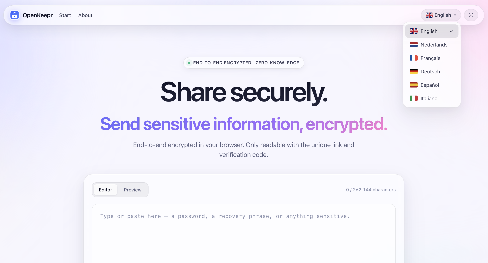
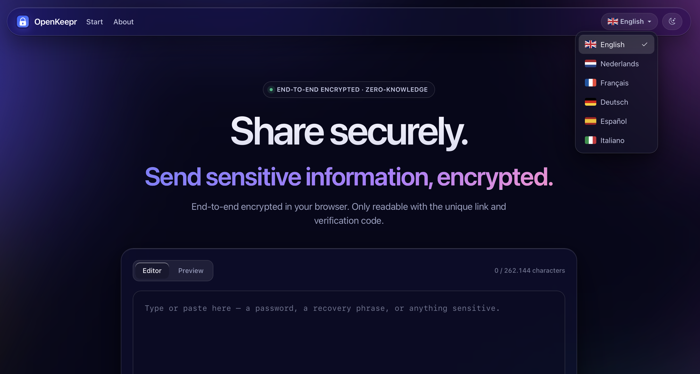

# OpenKeepr

**Zero-knowledge encrypted message sharing — for the times "just send it in an email" isn't good enough.**

OpenKeepr lets you create a one-time, self-destructing message (a password, an API key, a recovery phrase) and share it via a single short link. The content is encrypted **in your browser** before it ever leaves your device; the server cannot read it, and neither can the operator.

<p align="center">
  <strong>🌐 <a href="https://openkeepr.com">Try it live at openkeepr.com</a></strong>
</p>

<p align="center">
  <a href="https://openkeepr.com">
    
  </a>
  <a href="https://openkeepr.com">
    
  </a>
</p>

<p align="center">
  <a href="https://www.buymeacoffee.com/OpenKeepr" target="_blank">
    
  </a>
</p>

> **Status:** v1.4.0 — production-ready, but inspect the code and your own deployment before trusting it with real secrets. Security feedback welcome — see [`SECURITY.md`](SECURITY.md).

## Features

- Zero-knowledge AES-256-GCM encryption (key in URL fragment, never transmitted)
- Encrypted attachments — filename, MIME-type and contents are inside the ciphertext
- Optional recipient e-mail allow-list with 6-digit verification codes
- Auto-expire after N hours/days (hard cap: **30 days**) and / or N opens
- Markdown messages with live preview — auto-detected, no toggle required
- Dark / light / system-auto theme that persists between visits
- 6 languages out of the box: English, Dutch, French, German, Spanish, Italian
- Glassmorphism redesign with frosted-glass UI surfaces and an aurora background
- Fully offline assets — no CDN; vendored files auto-fetched on first start
- REST API with scoped API keys, rate limiting and Markdown docs at `/docs/api`
- Admin dashboard with audit log, feedback inbox, 2FA, maintenance mode
- User feedback form (with optional GitHub redirect)
- SQLite by default — single file, easy backups
- SEO + sharing ready: per-language meta tags, OpenGraph / Twitter Cards,
  hreflang alternates, sitemap.xml, robots.txt with bad-bot blocks
- Strict Content-Security-Policy with per-request nonces — no `'unsafe-inline'`

## Quick start (local development on macOS with pyenv)

### 1. Install Python with pyenv

```bash
brew install pyenv
pyenv install 3.12.10
```

The repo pins `3.12.10` via `.python-version`, so pyenv will auto-select it inside this directory.

> **macOS 26+ note:** older Python patches (≤ 3.12.5) fail to build because Homebrew's `tcl-tk` is now version 9 and breaks the `_tkinter` C extension. OpenKeepr doesn't use tkinter, but pyenv aborts anyway. Either install **3.12.6 or newer** (recommended — `3.12.10` does the trick), or temporarily `brew unlink tcl-tk` before building an older Python and `brew link tcl-tk` afterwards.

### 2. Create and activate a venv inside the project

```bash
cd /path/to/openkeepr
python -m venv .venv
source .venv/bin/activate
python -m pip install --upgrade pip
pip install -r requirements.txt
```

The venv lives in `.venv/` and is git-ignored. To leave it: `deactivate`.

### 3. Configure environment

```bash
cp .env.example .env
# Generate three strong secrets:
python -c "import secrets;print(secrets.token_urlsafe(64))"   # SECRET_KEY
python -c "import secrets;print(secrets.token_urlsafe(64))"   # RECIPIENT_HASH_SECRET
python -c "import secrets;print(secrets.token_urlsafe(64))"   # SERVER_ENCRYPTION_KEY
# Paste each into .env
```

### 4. Fetch offline vendored assets (Bootstrap, marked.js, DOMPurify, …)

```bash
python scripts/fetch_assets.py
```

This downloads pinned, integrity-checked copies into `app/static/vendor/`. Re-run when you want to update versions (edit `scripts/fetch_assets.py` to bump).

### 5. Run

```bash
python run.py
# → http://127.0.0.1:5000
```

On first boot, OpenKeepr will print the initial admin password to the console **once**. Save it, then log in at `/admin` and turn on 2FA immediately.

## Production deployment (Debian VPS)

See [`deploy/README.md`](deploy/README.md) for a step-by-step guide.

## Configuration

All runtime configuration is via environment variables. See [`.env.example`](.env.example) for the full list with comments.

## API

OpenKeepr exposes a REST API at `/api/v1`. Documentation lives at [`docs/api.md`](docs/api.md) and is rendered at `/docs/api` in the running app. Generate an API key from your account settings.

## Translations

Source language is **English**. Translations for `nl, fr, de, es, it` live in `app/translations/<lang>/LC_MESSAGES/messages.po`.

You do **not** need to run anything manually after changing strings:

- On every app start, source strings are re-extracted and merged into the `.po` files (if `AUTO_COMPILE_TRANSLATIONS=true`).
- The `.mo` files are recompiled automatically when their `.po` is newer.

Want to add or update a translation by hand? Edit the `.po` file and restart. That's it.

## Offline assets

All CSS, JS, fonts and icons are served from `app/static/vendor/`. No CDN is contacted at runtime. To update versions, edit `scripts/fetch_assets.py` (the manifest at the top of the file is the source of truth) and re-run it.

## Security

See [`SECURITY.md`](SECURITY.md) for our threat model and reporting policy. Notably:

- The server cannot read message content.
- Database leaks do not expose plaintext.
- 2FA is supported (and required for admin).

## Contributing & feedback

- Bug reports / feature requests: open an issue on GitHub, or use the in-app "Send feedback" form.
- Security issues: see `SECURITY.md` — do **not** open a public issue.

## Support the project

If OpenKeepr saves you from sending one more password over chat, consider buying me a coffee — it keeps the lights on and the secrets encrypted.

<a href="https://www.buymeacoffee.com/OpenKeepr" target="_blank">
  
</a>

## License

[MIT](LICENSE)
